# Project Knowledge State Lifecycle

- **Status:** ready
- **Date:** 2026-09-07
- **Related:** [`docs/project-notes-schema.md`](./project-notes-schema.md)
- **Governing directories:** `.agents/local/`, `.agents/notes/`

## Purpose

This document defines **how project knowledge moves** through the agent harness:
where it originates, what triggers its conclusion, and where each conclusion is
filed. It is the companion to the note *schema* — the schema fixes the shape of
a note, this document fixes the *flow* that produces it.

## Two storage regions

Project knowledge has exactly two homes, split by whether the work is settled:

| Region | Tracked by git | Mutability | Holds |
|---|---|---|---|
| `.agents/local/` | **no** (git-ignored) | mutable, disposable | In-flight requirement docs (PRD / SPEC / contract) — the live state of work in progress |
| `.agents/notes/` | **yes** | see tracks | Concluded knowledge, one note per conclusion |

The split is the heart of the model: **mutable working docs stay out of git;
only settled conclusions are tracked.** Nothing is promoted until it has
actually concluded.

Note that `.agents/notes/` is append-only **as a record of conclusions** — a
conclusion is never rewritten to fake a different outcome — but the
current-truth notes within it are *maintained* in step with the code (see
[Current-truth track](#current-truth-track-implemented-deprecated-fixed)).
"Append-only" governs what may be *concluded away*, not whether a live feature's
note may be kept current.

## The five note types, on two tracks

Concluded knowledge is filed by type, one directory per type. The types are
**not** one flat list — they split across two semantic tracks that behave
differently with respect to the code.

| `type` | Directory | Track | Meaning | Syncs with code? |
|---|---|---|---|---|
| `implemented` | `notes/implemented/` | current-truth | The feature is **live in the code right now** | **yes** |
| `deprecated` | `notes/deprecated/` | current-truth | Was implemented, since **removed / superseded** | yes |
| `fixed` | `notes/fixed/` | current-truth | A reported **defect is repaired** | yes |
| `rejected` | `notes/rejected/` | terminal | A proposal was **explicitly declined** | yes (never changes once declined) |
| `archived` | `notes/archived/` | history | A step-by-step snapshot of **how the repo got here** — for AGENT recall only | **no** |

### Current-truth track (`implemented`, `deprecated`, `fixed`)

These describe what the code **currently** is, so they must stay in step with
it. When the code changes, the corresponding note changes with it:

- A feature that is implemented stays `implemented` while it lives.
- A feature removed from the code moves to `deprecated` — and the removal
  commit is recorded in the note's commit set.
- A defect that is repaired is recorded as `fixed`.

Because they mirror the code, a current-truth note is **updated in place** as
the code evolves: one note per live feature, always the present-tense snapshot.
The *history* of that evolution is carried by the note's commit set (below),
not by keeping one file per version.

### History track (`archived`)

`archived` does **not** describe the present code and is deliberately **not**
kept in sync with it. It accumulates snapshots of how the repo reached its
current shape, so a future AGENT can reconstruct the sequence — "what was done,
in what order, and why" — without replaying old sessions.

Because it is out of sync on purpose, an `archived` note must **not** be used to
guide future work or to infer the current state of the code. For "what is true
now", read the current-truth track (or the code itself).

### Terminal type (`rejected`)

`rejected` sits outside both tracks: it records a proposal that was explicitly
declined. It has **no code to fall back on**, so its note must be
**self-sufficient** — the proposal and the decisive reason are recorded in the
note itself, with the full proposal document promoted alongside it rather than
left orphaned in the untracked `.agents/local/`.

## The promotion gate

Knowledge crosses from `.agents/local/` into `.agents/notes/` only through a
single gate: **the conclusion is confirmed.**

- For a feature: confirmed correct **and** implemented in the code.
- For a defect: confirmed fixed.
- For a proposal: an explicit decline (a user decision, a closed/rejected PR or
  issue, a revert) — never merely the absence of implementation.

Crossing the gate does two things:

1. **Distill the PRD / SPEC** (and quality contract) into the note body — a
   distillation, plus pointers at the source docs. The note never replaces the
   source documents.
2. **Record the commit set** — every commit relevant to this change, **one line
   per change** (hash + subject). Full change history, not just the newest
   commit: this is what lets a reader trace the evolution from the note alone.

Promotion is **one-way and append-only**. Source docs stay in `.agents/local/`
for provenance; a concluded note is never rewritten to fake a conclusion.

## Diagram

English-only labels (safe for graphviz default fonts, which may lack CJK glyphs).

```dot
digraph project_knowledge_lifecycle {
  rankdir = LR;
  compound = true;
  graph [fontname = "Helvetica", splines = ortho, nodesep = 0.4, ranksep = 1.2];
  node  [shape = box, style = "rounded,filled", fontname = "Helvetica", fontsize = 10];
  edge  [fontname = "Helvetica", fontsize = 9, color = "#555555"];

  /* ---------- origin: working state ---------- */
  subgraph cluster_working {
    label = ".agents/local/  +  Agent Context\n(UNTRACKED · mutable · in-flight)";
    style = rounded; color = "#c9a227"; fillcolor = "#fffdf5";
    fontname = "Helvetica"; fontsize = 10;
    local [label = "PRD / SPEC / contract\nworking docs", fillcolor = "#fff3cd"];
    ctx   [label = "Agent Context\n(conversation · decisions)", fillcolor = "#fff3cd", shape = note];
  }

  /* ---------- confirmation gate ---------- */
  gate [label = "PROMOTION GATE\nconclusion\nconfirmed?", shape = diamond,
        style = "filled", fillcolor = "#e8eaf6"];

  /* ---------- destination: concluded state ---------- */
  subgraph cluster_notes {
    label = ".agents/notes/   (TRACKED · conclusions never rewritten)";
    style = rounded; color = "#666666"; fillcolor = "#fafafa";
    fontname = "Helvetica"; fontsize = 10;

    subgraph cluster_sync {
      label = "current-truth track  (SYNCS with code)";
      style = rounded; color = "#2e7d32"; fillcolor = "#f4faf5";
      fontname = "Helvetica"; fontsize = 9;
      implemented [label = "implemented/\nfeature live in code", fillcolor = "#d4edda"];
      fixed       [label = "fixed/\ndefect repaired",            fillcolor = "#d4edda"];
      deprecated  [label = "deprecated/\nremoved · superseded",  fillcolor = "#f8d7da"];
    }

    rejected [label = "rejected/\nexplicitly declined\n(self-sufficient note)", fillcolor = "#e9ecef"];

    subgraph cluster_hist {
      label = "history track  (NO sync · AGENT recall only)";
      style = rounded; color = "#7a7a7a"; fillcolor = "#f7f7f7";
      fontname = "Helvetica"; fontsize = 9;
      archived [label = "archived/\nhow the repo got here\nstep by step", fillcolor = "#e2f0fb"];
    }
  }

  /* ---------- transitions ---------- */
  local -> gate [label = "distill PRD/SPEC\n+ commit hashes (h3 set)"];
  ctx   -> gate;

  gate -> implemented [label = "feature\nconfirmed",       color = "#2e7d32", style = bold];
  gate -> fixed       [label = "defect\nconfirmed fixed",  color = "#2e7d32"];
  gate -> rejected    [label = "explicitly\ndeclined",     color = "#c62828"];

  implemented -> deprecated [label = "removed from code\n(record removal commit)", color = "#c62828", style = bold];
  deprecated -> implemented [label = "re-introduced", style = dashed];

  implemented -> archived [style = dotted, color = "#7a7a7a"];
  fixed       -> archived [style = dotted, color = "#7a7a7a"];
  deprecated  -> archived [style = dotted, color = "#7a7a7a"];
  rejected    -> archived [style = dotted, color = "#7a7a7a"];
}
```



Render with:

```bash
dot -Tpng lifecycle.dot -o lifecycle.png
# or paste into https://dreampuf.github.io/GraphvizOnline
```

Save the `.dot` file as UTF-8 without BOM on Windows.

## Reading the diagram

- **Left (yellow)** is the only entry point: PRD/SPEC/contract under
  `.agents/local/`, plus Agent Context — the conversation and decisions that
  produced them. Both feed the **promotion gate**.
- **The gate** is the confirmation step. On crossing: distill the source docs
  and record the commit set.
- **Right side splits into two tracks.** Green = current-truth, kept in sync
  with the code; grey = history (`archived`), deliberately out of sync and for
  AGENT recall only. The four dotted edges mean any conclusion may also
  contribute a step to the history track.
- `rejected` stands apart: terminal, self-sufficient, never implies anything
  about the code.

## Open point

The diagram draws `implemented` as **one note per live feature, updated in
place** as the code evolves (the evolution being carried by the commit set). The
alternative — appending a new note per evolution — would scatter one feature
across many files. The in-place reading is assumed here; if it is wrong, the
schema needs an explicit `history:` / `supersedes:` field instead.

## Relationship to the note schema

[`project-notes-schema.md`](./project-notes-schema.md) currently specifies a
**three-type** vocabulary (`archived` / `fixed` / `rejected`). This document
supersedes that vocabulary with the **five-type, two-track** model above, which
is a **breaking change**: it adds directories, redefines `archived`, and adds
the commit-set field. Adopting it therefore requires:

1. Bumping the schema to `project-notes/v2` per the versioning policy, with a
   migration note.
2. Updating the consumers: `writing-project-notes`, `retrieving-project-notes`,
   `scripts/scan_notes.py`, and `init-agent-harness` / the template scaffold
   (all of which still reference the three-type split).
